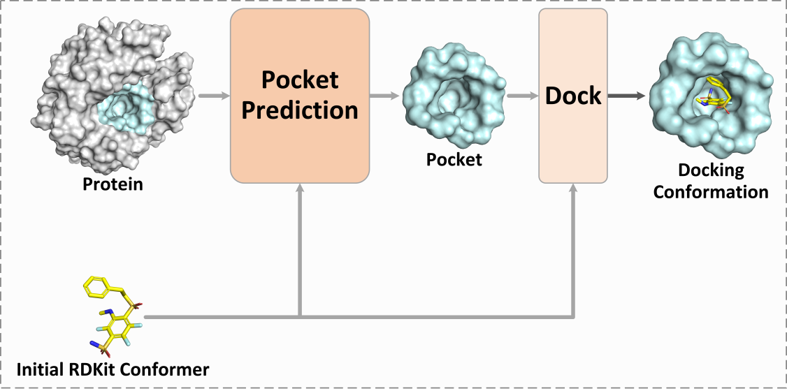

<h1 align="center">
PPDOCK:Pocket prediction-based protein-ligand blind docking
</h1>

## Overview
This repository contains the source code of PPDOCK. If you have any questions, please do not hesitate to open an issue or contact me via <duj23@m.fudan.edu.cn>. I am happy to hear from you!




## Setup Environment
```shell
conda create --name PPDOCK python=3.8
conda activate PPDOCK
conda install pytorch==1.12.0 torchvision==0.13.0 torchaudio==0.12.0 cudatoolkit=11.3 -c pytorch
pip install https://data.pyg.org/whl/torch-1.12.0%2Bcu113/torch_cluster-1.6.0%2Bpt112cu113-cp38-cp38-linux_x86_64.whl
pip install https://data.pyg.org/whl/torch-1.12.0%2Bcu113/torch_scatter-2.1.0%2Bpt112cu113-cp38-cp38-linux_x86_64.whl
pip install https://data.pyg.org/whl/torch-1.12.0%2Bcu113/torch_sparse-0.6.15%2Bpt112cu113-cp38-cp38-linux_x86_64.whl 
pip install https://data.pyg.org/whl/torch-1.12.0%2Bcu113/torch_spline_conv-1.2.1%2Bpt112cu113-cp38-cp38-linux_x86_64.whl
pip install https://data.pyg.org/whl/torch-1.12.0%2Bcu113/pyg_lib-0.2.0%2Bpt112cu113-cp38-cp38-linux_x86_64.whl
pip install torch-geometric==2.4.0
pip install torchdrug==0.1.2 torchmetrics==0.10.2 tqdm mlcrate pyarrow accelerate Bio lmdb fair-esm tensorboard
pip install fair-esm
pip install rdkit-pypi==2021.03.4
conda install -c conda-forge openbabel 
```

## Data 
The training data we use comes from FAbind. You can download it through this [link](https://zenodo.org/records/11352521). 

The original PDBbind 2020 dataset can be downloaded from http://www.pdbbind.org.cn.

If you have a molecule file in .sdf or .mol2 format and a protein file in .pdb format, and you want to use PPDOCK for pocket prediction or protein-ligand blind docking, you can use the dataset construction scripts provided in the dataset_creation folder. In general, running scripts 1 to 4 in sequence will complete the data construction process. However, please note that the preprocessing of molecules and proteins is relatively complex. We recommend first understanding how the dataset construction scripts work before adapting them to your own data files.

## Train
### Data preprocessing
1. Download dataset from [link](https://zenodo.org/records/11352521)
2. Unzip the `zip` file and place it into the '1_Predict_Pocket' folder. Please ensure that the file name is 'pdbbind2020'. 

### Generate the ESM2 embeddings for the proteins
Run the following command under the path of the '1_Predict_Pocket' to generate ESM2 embeddings for the proteins.

```shell
data_path=pdbbind2020
python data_processing/generate_esm2_t33.py ${data_path}
```

After completing the generation of ESM2 embeddings, you can delete some useless files in the directory and only keep the files shown below.

```shell
pdbbind2020
  --dataset
    --processed
        --compound_LAS_edge_index.lmdb
        --esm2_t33_650M_UR50D.lmdb
        --protein_1d_3d.lmdb
        --compound_rdkit_coords.pt
        --data.pt
```

The original 'data.pt' file contains a lot of redundant information, so we cleaned it. Please replace the original 'data.pt' file with the 'data.pt' file provided in 'data_processing'.

### Training model
PPDOCK consists of two parts: 'Pocket Prediction' and 'Dock', which are trained separately. 

We provide the model weights for each part, which you can download through [best_model](https://zenodo.org/records/12703513). If you use the model weights we provide for inference, please place the 'anchor.pt' file in 'data_processing' folder into the 'processed' folder of 'pdbbind2020'.

We first train the 'Pocket Prediction' part using the following command under the path of '1_Predcit_Pocket'.

```shell
accelerate launch main_train.py
```

After completing the training of the 'Pocket Prediction' part, please place the model weights you select in 'result' folder into the 'best_model' folder, Then use the following command to test the 'Pocket Prediction' part and generate the 'anchor.pt' file for training the 'Dock' part.

```shell
accelerate launch main_test.py
```
Place the generated 'anchor.pt' file into the 'processed' folder of the 'pdbbind2020'. Then place the entire 'pdbbind2020' data file into the '2_Dock' folder.

Use the following command to train the 'Dock' part under the path of '2_Dock'.
```shell
accelerate launch main_train.py
```
After completing the training of the 'Dock' part, use the following command to test the 'Dock' part.
```shell
accelerate launch main_test.py
```

## About
### Acknowledegments
We appreciate [EquiBind](https://github.com/HannesStark/EquiBind), [TankBind](https://github.com/luwei0917/TankBind), [E3Bind](https://openreview.net/forum?id=sO1QiAftQFv), [DiffDock](https://github.com/gcorso/DiffDock), [FABind](https://github.com/QizhiPei/FABind/tree/main/FABind) and other related works for their open-sourced contributions.
